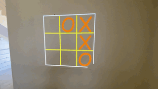

# augmented reality tic-tac-toe. 

tic tac toe game using opencv, pillow, pygame and numpy
The game needs aprojector to project the game board to the wall. and a webcam capture the ball hits.  
  
opencv- getting the webcam input and determining the ball hits.  
pillow- creating the game board. 
pygame- music. 

# quick rundown
1.geting input from webcam.   
2.projecting the game board.    
3.calibrate the cemara with board corners (selecting them manually).  
4.creating a birdseyeview of the game board using our corners.  
5.creating a mask to the ball color (blue).  
6.checking where the ball hits.   
7.displaying the result.  

# Game interface 

At game start 3 windows will open.    
2 opencv windows: user and msak.    
and a photo preview window.    

## photo preview 
This is our output to the projector.   
this was implemented using python pillow library and controlled by boardcreate.py.  

## mask
A mask of the game board using the birdseyeview.  

## user 
user interface.  
uses keyboard commennds as follows: (there's a text in the left corner indicateing the game phase). 

1 = selects top left corner of the board.  
2 = selects top right corner of the board.  
3 = selects bottom right corner of the board.  
4 = selects bottom left corner of the board.  
5 = starts the music.  
r = restarts the game.   

note: corners are selected using the mouse, just click on the correct corner.
